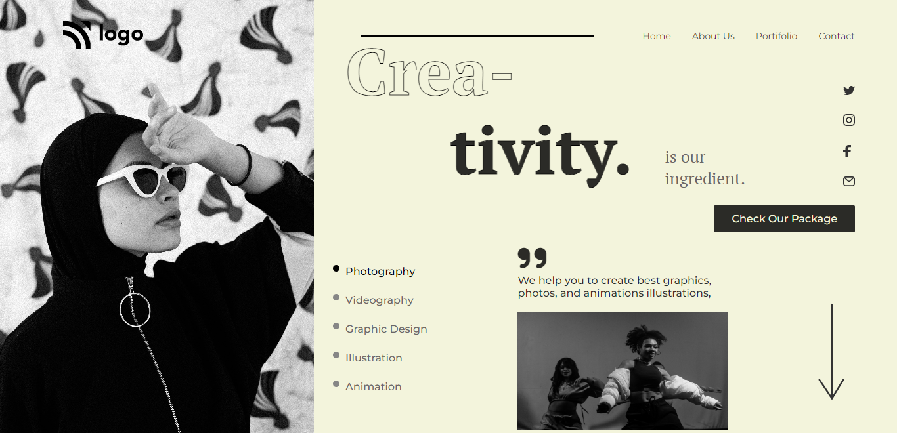

## Designer Home page

### While building landing page--Learnt:
- How to set `background-image` to one side and structure text to otherside.
- Drawing lines and dots and positioning them using `position` property. 

### Time taken: 7 hours.

### [Live Link](https://14-designer-homepage-vivekn.netlify.app/)

### Quick Look:
